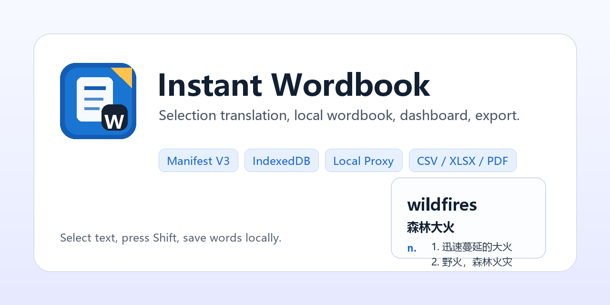
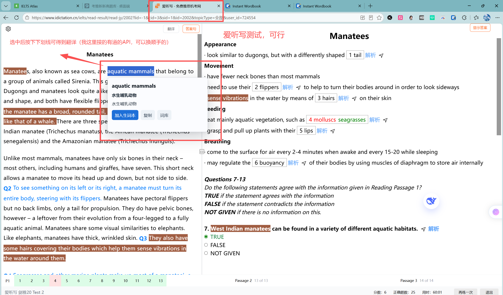
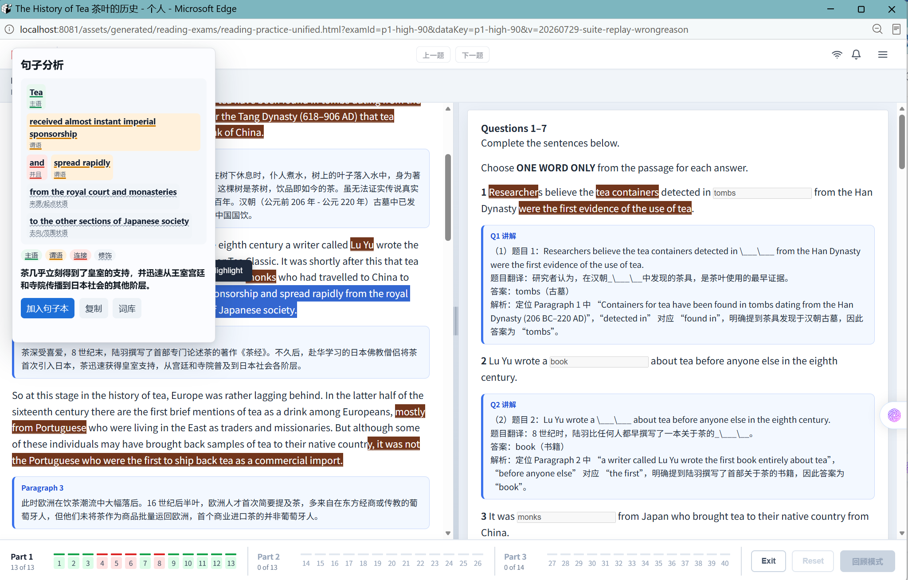
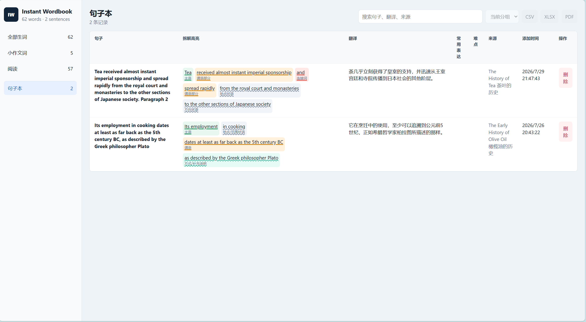
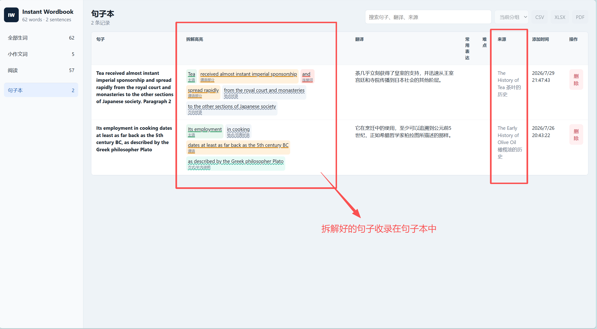

<p align="center">
  
</p>

<h1 align="center">LELTS Translate</h1>

<p align="center">
  <strong>Browser selection translation, GPT sentence parsing, local wordbook, dashboard, and export tools for English reading practice.</strong>
</p>

<p align="center">
  
  
  
  
</p>

## What Is This?

LELTS Translate, also known in the extension UI as **Instant Wordbook**, is a local-first Chrome/Edge extension for English reading practice.

It is not only a simple selection translator. It combines:

- Selection word and phrase translation
- Local wordbook management
- GPT-powered sentence structure analysis
- A sentence notebook that preserves parsed components and highlights
- A dashboard for searching, editing, moving, deleting, and exporting learning data

The project is especially useful for IELTS-style reading practice, English news reading, and local HTML reading exercises.

## Preview

### Selection Translation

<p align="center">
  
</p>

### Sentence Analysis

<p align="center">
  
</p>

### Sentence Notebook

<p align="center">
  
</p>

### Saved Sentence Breakdown

<p align="center">
  
</p>

## Features

- Select a word or phrase, then press `Shift` to translate.
- Select a full sentence, then press `Ctrl+R` to analyze sentence structure with GPT.
- Highlight sentence components with different colors, such as subject, predicate, modifier, connector, and clause.
- Hover over a highlighted component to view the short explanation returned by GPT.
- Save words into local notebooks, including the default `小作文词` and `阅读` groups.
- Save analyzed sentences into the local `句子本`.
- Manage data in the dashboard: search, edit, move, delete, and create groups.
- Export wordbook data to `CSV`, `XLSX`, and `PDF`.
- Use IndexedDB for local storage.
- Keep API secrets outside extension source code by using a local Node.js proxy server.

## How It Works

```txt
Web page selection
  -> Manifest V3 content script
  -> Extension service worker
  -> Local Node.js server
  -> Translation API / GPT API
  -> Browser popup and local IndexedDB
```

The extension itself does not contain private API keys. All API requests go through the local server at:

```txt
http://127.0.0.1:8787
```

## Requirements

- Windows, macOS, or Linux
- Node.js 18 or later
- npm
- Chrome or Microsoft Edge
- API credentials for translation and/or GPT sentence analysis

## Quick Start

```powershell
git clone https://github.com/<your-name>/LELTS-translate.git
cd LELTS-translate
npm install
cp local-server/.env.example local-server/.env
npm run server
```

Then load the extension directory in Chrome or Edge:

```txt
extension/
```

## API Configuration

Copy the example environment file:

```powershell
cp local-server/.env.example local-server/.env
```

Edit `local-server/.env`:

```txt
YOUDAO_APP_KEY=
YOUDAO_APP_SECRET=
YOUDAO_MOCK=false
PORT=8787
PDF_FONT_PATH=

MLAI_API_KEY=
MLAI_BASE_URL=https://www.mlai.online/
MLAI_MODEL=gpt-5.4-mini
MLAI_MOCK=false
```

### Translation API

The current implementation supports Youdao translation through the local server.

You need to apply for your own API credentials. Platforms such as Youdao, iFlytek, and other language API providers often provide free or trial quotas. Check the provider console for current quota, pricing, and service rules.

Only the following file should contain private credentials:

```txt
local-server/.env
```

Do not commit this file.

### GPT Sentence Analysis API

Sentence analysis uses an OpenAI-compatible chat completions endpoint.

Default example:

```txt
MLAI_BASE_URL=https://www.mlai.online/
MLAI_MODEL=gpt-5.4-mini
```

The model can also be changed from the extension options page:

1. Open the extension details page.
2. Open **Extension options**.
3. Click **Refresh models**.
4. Choose a model such as `gpt-5.4-mini`, `gpt-5.4`, or `gpt-5.6`.
5. Save.

Speed note from local testing:

- `gpt-5.4-mini`: fastest, good as the default
- `gpt-5.4`: balanced
- `gpt-5.6`: slower, useful when you want more detailed parsing

## Load In Browser

Chrome:

```txt
chrome://extensions
```

Edge:

```txt
edge://extensions
```

Steps:

1. Enable **Developer mode**.
2. Click **Load unpacked**.
3. Select the project `extension/` directory.
4. Refresh the web page where you want to use the extension.
5. For local `file:///` HTML pages, enable **Allow access to file URLs** in the extension details page.

## Usage

### Translate Words

```txt
Select an English word or phrase -> press Shift -> view translation popup -> add to wordbook
```

### Analyze Sentences

```txt
Select an English sentence -> press Ctrl+R -> view highlighted sentence analysis -> add to sentence notebook
```

The sentence popup focuses on:

- Highlighted sentence components
- Full Chinese translation
- Short hover explanations for each component

Sentence analysis is not query-cached by default. Each `Ctrl+R` analysis calls the GPT API directly.

### Manage Your Data

Click the extension icon to open the dashboard.

You can:

- Search words or sentences
- Edit word translations
- Move words between notebooks
- Delete saved items
- View saved sentence breakdowns
- Export wordbook data

## Testing

Run all tests:

```powershell
npm run test:all
```

Run specific test groups:

```powershell
npm test
npm run smoke:server
npm run test:ui
npm run test:e2e
```

Test coverage includes:

- Text normalization
- Youdao signing logic
- CSV export
- Local server health checks
- XLSX and PDF export
- Dashboard UI
- Extension end-to-end flow
- GPT sentence analysis and sentence notebook persistence

## Project Structure

```txt
extension/          Browser extension source
  background.js     Manifest V3 service worker
  content/          Selection listener and popup UI
  dashboard/        Wordbook and sentence notebook dashboard
  options/          Local server and GPT model settings
  shared/           Browser-side shared utilities

local-server/       Local Node.js API proxy and export service
shared/             Node/browser shared utilities
tests/              Unit, smoke, UI, and E2E tests
docs/               README assets and screenshots
scripts/            Development helper scripts
```

## Privacy And Security

- Real API keys are not included in this repository.
- `local-server/.env` is ignored by Git.
- The extension source does not contain private credentials.
- Word and sentence notebook data is stored locally in browser IndexedDB.
- New translations call the configured translation API.
- GPT sentence analysis calls the configured GPT API.
- Export files are generated locally.

Before publishing your own fork, check:

```powershell
git status --short
git ls-files local-server/.env
```

`git ls-files local-server/.env` should print nothing.

## Known Limitations

- The extension cannot run on browser internal pages such as `chrome://` or `edge://`.
- Local file pages require explicit browser permission.
- GPT sentence analysis speed depends on the model and API provider.
- XLSX and PDF export require the local server to be running.

## License

This project is released under the [MIT License](LICENSE).
